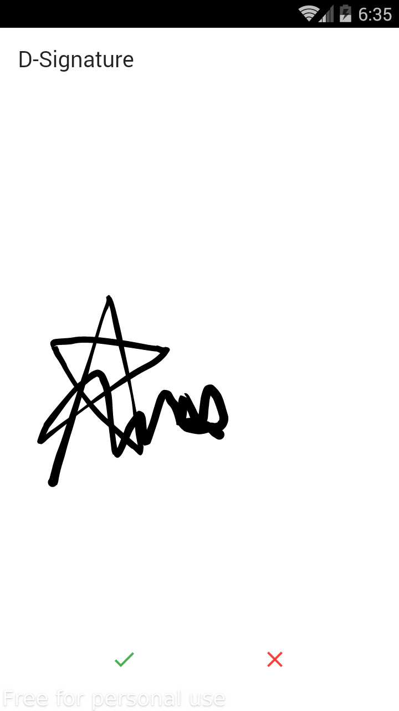
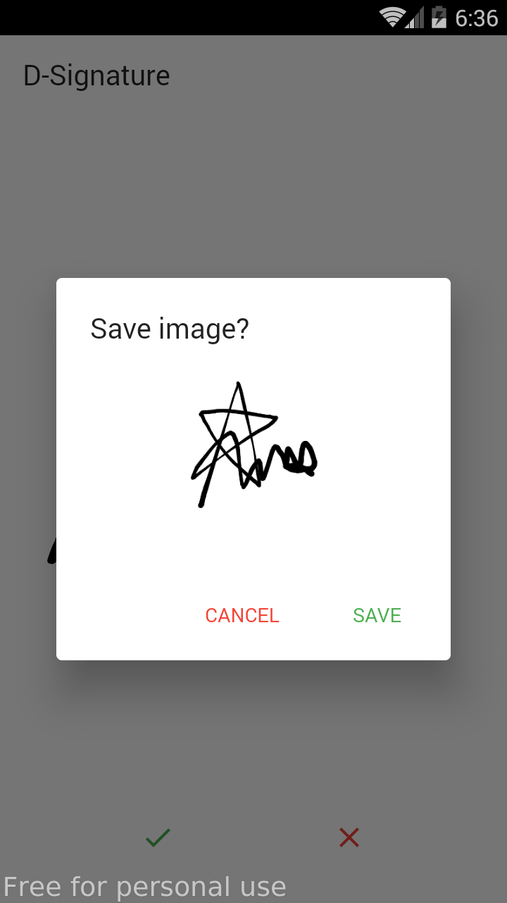
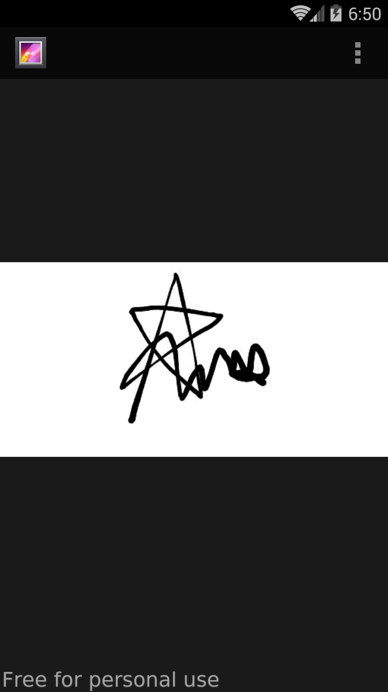

A simple digital signature based on Dart

 

### Results


## How to build on your environment
Clone the repository and run the following commands:
```
flutter pub get
flutter run
```

## Open-source libraries
- [hand_signature](https://pub.dev/packages/hand_signature) -  Drawing smooth signatures
- [image_gallery_saver](https://pub.dev/packages/image_gallery_saver) -  Saving images to the gallery
- [permission_handler](https://pub.dev/packages/permission_handler) -  API to request permissions

## Supports :coffee:
If you feel like support me a coffee for my efforts, I would greatly appreciate it. <br><br>
<a href="https://www.buymeacoffee.com/radikz" target="_blank"></a>
